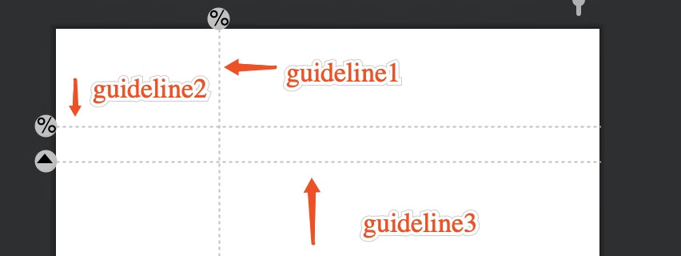

## 1、guidelie 的例子

1、绝对定位：使用layout_constraintGuide_begin和layout_constraintGuide_end  
2、百分比定位：使用layout_constraintGuide_percent  
3、使用 orientation 设置 guidelie 的方向



```html
    <androidx.constraintlayout.widget.Guideline
        android:id="@+id/guildLine1"
        android:layout_width="0dp"
        android:layout_height="0dp"
        android:orientation="vertical"
        app:layout_constraintGuide_percent="0.3" />

    <androidx.constraintlayout.widget.Guideline
        android:id="@+id/guildLine2"
        android:layout_width="0dp"
        android:layout_height="0dp"
        android:orientation="horizontal"
        app:layout_constraintGuide_percent="0.1" />

    <androidx.constraintlayout.widget.Guideline
        android:id="@+id/guildLine3"
        android:layout_width="0dp"
        android:layout_height="0dp"
        android:orientation="horizontal"
        app:layout_constraintGuide_begin="100dp" />
```

## 2、Barrier 的例子

有3个控件 ABC，C 在 AB 的右边，但是 AB 的宽是不固定的，这个时候 C 无论约束在 A 的右边或者 B 的右边都不对。当出现这种情况可以用 Barrier 来解决。
Barrier 可以在多个控件的一侧建立一个屏障，如下所示：


`app:barrierDirection` 为屏障所在的位置，可设置的值有：bottom、end、left、right、start、top  
`app:constraint_referenced_ids` 为屏障引用的控件，可设置多个(用“,”隔开)  

```html
    <Button
        android:id="@+id/TextView1"
        android:layout_width="wrap_content"
        android:layout_height="wrap_content"
        android:layout_marginStart="30"
        android:text="btn1"
        app:layout_constraintStart_toStartOf="parent"
        app:layout_constraintTop_toTopOf="parent" />

    <Button
        android:layout_marginStart="40"
        android:id="@+id/TextView2"
        android:layout_width="wrap_content"
        android:layout_height="wrap_content"
        android:text="btn2"
        app:layout_constraintStart_toStartOf="parent"
        app:layout_constraintTop_toBottomOf="@+id/TextView1" />

    <androidx.constraintlayout.widget.Barrier
        android:id="@+id/barrier"
        android:layout_width="wrap_content"
        android:layout_height="wrap_content"
        app:barrierDirection="right"
        app:constraint_referenced_ids="TextView1,TextView2" />

    <Button
        android:id="@+id/TextView3"
        android:layout_width="wrap_content"
        android:layout_height="wrap_content"
        android:layout_marginStart="30"
        android:text="btn3"
        app:layout_constraintLeft_toRightOf="@+id/barrier" />
```

